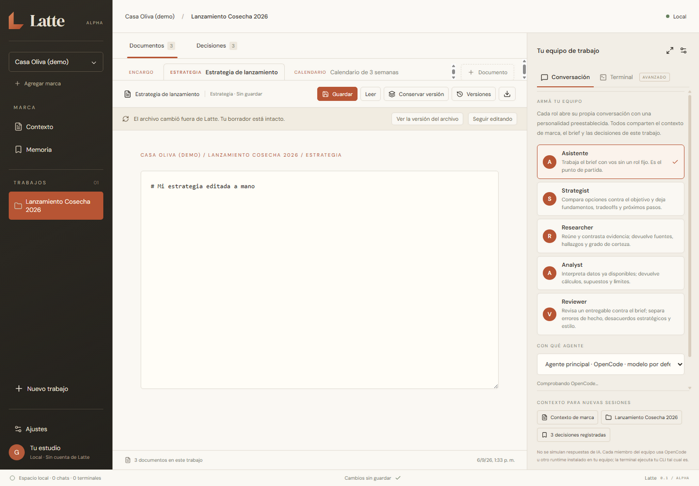

# Latte · An Agent Marketing Platform

Espacio de trabajo de escritorio, local, para marketers que dirigen agentes de IA.
Marcas, trabajos, varios entregables Markdown por trabajo, versiones inmutables,
registro de decisiones, memoria de marca y conversaciones reales con agentes.
Todo en tu máquina.



> **Alpha personal.** Esto es código fuente, no un producto instalable. Se probó
> en Windows 11 por una sola persona. No hay instalador, no hay binario firmado,
> no hay actualizaciones automáticas y no hay soporte. Si lo usás, revisá lo que
> los agentes escriben antes de tomarlo por bueno.

## Instalación

```bash
git clone https://github.com/gabogabucho/latte.git
cd latte
npm ci
npm run dev
```

Con eso ya funciona: `npm run dev` levanta Vite y Electron sin compilar nada.
Es el camino recomendado y el único ejercitado a fondo.

### Opcional: renderer compilado

```bash
npm run build   # compila SOLO la interfaz (Vite) a dist/
npm start       # abre Latte usando dist/, sin servidor de desarrollo
```

Honestidad sobre esto: `npm run build` compila **solo el renderer**. El proceso
principal de Electron sigue ejecutando TypeScript en tiempo de ejecución a través
de tsx, igual que en desarrollo. No hay empaquetado, no hay instalador y no se
genera un ejecutable distribuible. Los dos comandos están configurados pero **no
fueron validados en esta entrega**: si `npm start` no encuentra `dist/`, te
dice exactamente qué correr.

### Requisitos

| Requisito | Detalle |
| --- | --- |
| Node.js | 24 LTS (el proyecto usa `node:sqlite`, incorporado en Node 24) |
| Sistema | Probado en Windows 11. Las rutas POSIX están escritas pero no ejercitadas en vivo |
| Agentes | Al menos uno instalado y con sesión iniciada: [Claude Code](https://claude.com/claude-code), [Codex](https://developers.openai.com/codex/cli/) u [OpenCode](https://opencode.ai) |
| Facturación | La inferencia la paga tu cuenta con tu proveedor. Latte no factura ni intermedia nada |
| Engram | Opcional, para memoria de marca. Sin él, la app lo dice y sigue andando |

La vista web (`npm run dev:web`) es solo previsualización de interfaz: guarda en
el navegador y **no ejecuta ningún agente**.

## Qué hace

- **Conversaciones por rol.** Cada trabajo tiene un equipo: el Asistente neutral más roles opcionales (Estrategia, Investigación, Análisis, Revisión). Cada miembro es una conversación propia con su runtime y su cuenta.
- **Instrucciones de marketing por defecto.** Toda conversación, incluida la neutral, recibe el comportamiento de marketing del pack `marketing-core`: objetivo, audiencia, oferta, etapa del embudo, baseline y restricciones antes de recomendar; hecho contra hipótesis; marca aprobada contra propuesta; experimentos con guardrail y cadencia de revisión.
- **Varios entregables por trabajo.** Encargo, estrategia, calendario, investigación y piezas, cada uno con su archivo Markdown, sus versiones y su exportación.
- **Guardado con verificación.** Un guardado hecho desde Latte se rechaza si el archivo cambió por fuera desde la última vez que Latte lo leyó, y se conservan las dos variantes.
- **Tres runtimes.** Claude Code y Codex con tu suscripción (login por navegador desde Ajustes), y proveedores por API key a través de OpenCode.

### Límites que conviene conocer

- Alpha de una sola persona: esperá bordes ásperos y cambios de esquema.
- **No todo lo que hace un agente está aislado.** Latte le da al agente la carpeta del trabajo como contexto y las instrucciones lo dicen, pero un runtime puede escribir cualquier archivo al que tenga permiso. Las instrucciones no son un sandbox. Los permisos reales los aplica cada runtime, y Latte te muestra sus pedidos para que decidas.
- Un guardado hecho **fuera** de Latte no se intercepta: reemplaza el archivo y Latte lo detecta después.
- El comportamiento de los modelos frente a las instrucciones de marketing **no está evaluado en vivo todavía**. Hay fixtures listas en `docs/marketing-eval/` para hacerlo.
- Sin publicación en redes, sin scheduling, sin integraciones y sin colaboración entre personas.

---

# English

# Latte · An Agent Marketing Platform

Latte is a local-first desktop workspace for marketers who direct AI agents.
Brands, works, several tracked Markdown deliverables per work, immutable
snapshots, a decision log, brand memory (Engram) and real agent sessions, all on
your machine.

- **Chat (default):** a native Latte chat on top of whichever runtime you picked as primary — Claude Code and Codex with your own subscription, or any API-key provider through [OpenCode](https://opencode.ai). One conversation per team member, inside that work's folder, streaming messages, tool calls, permission requests and questions into the UI. No fake replies: when a runtime, a provider or a balance is missing you see the real reason.
- **Terminal (advanced):** a real PTY running your CLI (`claude`, `codex`, `opencode`) inside the work folder, with Latte-managed `CLAUDE.md` / `AGENTS.md` context files. Global tool configuration is never touched.
- **Open source, no proprietary agent runtime.** Electron 44 · React 19 · TypeScript · Vite 7 · SQLite (Node builtin) · node-pty · xterm.

## Run it

```bash
npm ci               # one lockfile; node-pty ships an N-API prebuild, no rebuild
npm run dev          # Vite dev server in-process + Electron (main runs from TypeScript through tsx)
```

Optional, renderer only:

```bash
npm run build        # compiles the RENDERER to dist/ (Vite). The main process still runs TypeScript through tsx
npm start            # opens Latte against dist/, no dev server. Refuses with instructions if dist/ is missing
```

Neither `build` nor `start` was executed in this release: they are configured,
not validated. There is no packaging step and no installer.

Other commands:

| Command | What it does |
| --- | --- |
| `npm run build` | Compiles the renderer to `dist/` (renderer only; not validated in this release) |
| `npm start` | Runs Latte against `dist/`; refuses with instructions when it is missing |
| `npm run dev:web` | Vite only (browser preview with a localStorage backend, agents disabled) |
| `npm run dev:electron` | Electron only, expects Vite on `http://127.0.0.1:5173` |
| `npm test` | Vitest: backend + frontend unit tests |
| `npm run typecheck` / `typecheck:web` / `typecheck:all` | `tsc --noEmit` for `electron/**` and `src/**` |
| `npm run probe:electron` | Prints what the Electron runtime supports (`node:sqlite`, node-pty, sql.js) |
| `npm run smoke:desktop` | Runs the real app for 15 s, reports renderer console errors, exits |
| `npm run smoke:opencode` | Bounded live check of the chat path against the installed OpenCode (one tiny prompt; `LATTE_SMOKE_NO_INFERENCE=1` for protocol only) |

The main process is never bundled: `electron/main.cjs` registers `tsx/cjs`
(esbuild transform, standalone binary, no Electron ABI involved) and requires
`electron/main.ts`. The preload is plain CommonJS (`electron/preload.cjs`). The
renderer is served by Vite in dev and read from `dist/` after `npm run build`.

Environment variables:

| Variable | Purpose |
| --- | --- |
| `LATTE_DATA_DIR` | Data directory override (default `%APPDATA%/Latte/data` on Windows, Electron `userData/data` elsewhere) |
| `VITE_DEV_SERVER_URL` | Renderer URL for `dev:electron` |
| `LATTE_SMOKE_EXIT_MS` | Run the app for N ms, print renderer errors, exit 0/1 |

## Layout

```
electron/                 main process (TypeScript, run through tsx)
  main.cjs / main.ts      bootstrap, window, CSP, permissions, IPC wiring
  preload.cjs             contextBridge: exactly the LatteAPI surface
  bootstrap.ts            createBackend(): wires storage, files, runtimes, chat, memory
  core/                   ids, safe paths, atomic files, optional require
  storage/                SqlDriver adapter: node:sqlite primary, sql.js WASM fallback; repository + schema
  workspace/              work folders, brief.md, snapshots, generated instruction files, packs
  runtime/                CLI detection (allowlist), PTY sessions (node-pty, optional), env hygiene
  opencode/               structured chat: server process, HTTP+SSE client, event translation, ChatManager
  memory/                 Engram CLI adapter (bounded timeouts, graceful unavailable)
  services/               LatteService (validation + orchestration), demo seed
  ipc/                    channel list, arity checks, trusted-sender check, error envelopes
shared/contracts.ts       the API contract between renderer and main
src/                      React UI (ivory / espresso / terracotta), browser preview fallback
packs/marketing-core/     discipline pack prepended to every generated instruction file
tests/backend/            Vitest: persistence, validation, isolation, terminal, detection, IPC, chat protocol
scripts/                  dev.mjs, probe-electron.cjs, smoke-opencode.ts
```

## Data model

Everything lives under the data directory:

```
latte.db                                  SQLite: brands, works, revisions, decisions, chat_sessions, meta
brands/<brandId>/works/<workId>/
  brief.md                                the editable deliverable (single authority, see below)
  CLAUDE.md, AGENTS.md                    managed context: pack + brand context + brief + decisions
  README.md                               explains the folder to humans and agents
  .latte/snapshots/<timestamp>-<rev>.md   immutable snapshots (read-only files + DB triggers)
```

- **`Work.brief` is the deliverable.** The UI edits it, agents edit `brief.md`
  in the work folder. The file is the source of truth: `listWorks`,
  `snapshot`, `exportWork` and `startAgent`/`startChat` sync the database copy
  from disk, so agent edits appear on refresh. An intentionally blank brief
  exports blank.
- **Snapshots are immutable** twice: SQLite triggers reject `UPDATE`/`DELETE`
  on `revisions`, and the snapshot files are written once and marked read-only.
- **Instruction files are regenerated only when a new session starts**
  (`startAgent` / `startChat`) and when a work is created. Editing the brand
  context or adding a decision never rewrites files a running agent is reading.
  A user-owned `AGENTS.md` (without the `<!-- latte:managed -->` marker) is left alone.
- Ids are app-generated (`brd_…`, `wrk_…`, `rev_…`, `dec_…`, `ses_…`) and are
  the only path segments ever used on disk; `safeJoin` rejects anything else.

### Storage strategy

`node:sqlite` (Node 22.13+/24, shipped by Electron 44) is the primary engine: a
real file database, durable per statement, zero dependencies. If the builtin is
missing in a given runtime, the same schema runs on `sql.js` (WebAssembly) with
atomic write-back of the whole file. Both engines are tested against the same
repository suite and can open each other's files. Nothing native has to be
compiled. `npm run probe:electron` tells you which one your Electron will use.

## Agents

### Structured chat (OpenCode)

1. `chatStatus()` finds `opencode` on PATH and lazily starts
   `opencode serve --pure --port 0 --hostname 127.0.0.1` (real binary, not the
   npm cmd shim, so it can be stopped cleanly) with `OPENCODE_SERVER_USERNAME` /
   `OPENCODE_SERVER_PASSWORD` set to random values in the child environment.
   Credentials never appear on the command line or in logs.
2. `startChat(workId, model?)` regenerates `AGENTS.md`, creates (or resumes) an
   OpenCode session scoped to the work directory (`?directory=`), and persists
   the session id so the conversation survives app restarts.
3. One `GET /global/event` SSE subscription feeds every chat. Events are
   translated into `ChatEvent`s: message/part upserts, text deltas, status,
   permission and question requests, provider errors.
4. Permissions are answered with `once` / `always` / `reject`; questions with
   selected labels or a custom answer, or rejected.

The model picker lists what OpenCode reports as configured
(`/config/providers`). Latte never adds providers, keys or subscriptions.

### Primary agent and subscription runtimes

A new chat never asks which model to use. The **Proveedores de IA** screen
marks one agent as primary: a Claude Code account (your own subscription,
via `claude auth login`), a Codex account (ChatGPT login started from the
screen and finished in the browser) or one OpenCode provider/model. Claude
Code and Codex run as headless processes speaking their native protocols
(stream-json and app-server JSON-RPC); managed accounts are profile folders
under the data directory passed as `CLAUDE_CONFIG_DIR` / `CODEX_HOME`, exactly
the way Orca does it, and Latte never reads their credentials.

### Documents of a work

A work holds several tracked Markdown deliverables, not one file. `brief.md`
is the default one (the ask); a strategy, a calendar, research or copy pieces
each live in their own file next to it, with their own title, status, versions
and export. Latte generates every file name; user text never reaches a path.

**Saving never overwrites blindly.** Reading a document hands out a content
fingerprint (sha1 of the text). A save presents the fingerprint it started
from; if the file on disk moved to something Latte has not seen, the save is
refused as a conflict, the disk version is stored as an immutable revision with
source `external` (an outside write does not identify its author), and the UI
asks which variant stays. The other one is always kept as a version. External
changes are noticed by polling that fingerprint for the open document, which
survives atomic write-and-rename, unlike an inode watcher. This protects
against blind overwriting; it is not mutual exclusion between processes, and
instructions to an agent are not filesystem isolation.

A derived document (a calendar built on a strategy) pins the exact base
revision it used. When that base changes, the derived document says it needs a
look; nothing is regenerated and nothing is declared wrong.

### Team: roles with their own conversation

The agent panel is the work's **team** (the "Equipo de trabajo" of the
reference mockup). A member is a role opened inside the work: it has its own
conversation, runtime and account, and a live status (working, idle, needs
you, paused, finished). Roles ship with the discipline pack
(`packs/marketing-core/roles/*.md`: Strategist, Researcher, Analyst,
Reviewer) plus the neutral Asistente; each one is a small front matter (name,
initial, summary) followed by the instructions. Adding a member uses the
primary agent unless you pick another logged-in account or OpenCode.

The role personality is appended to the runtime's own system prompt for that
member only, so the shared `CLAUDE.md` / `AGENTS.md` context stays identical
for the whole team: Claude Code gets `--append-system-prompt-file` (a file
under the data directory, never the command line), Codex gets
`developerInstructions` on `thread/start` / `thread/resume`, OpenCode gets
the `system` field of each prompt. The Asistente sends nothing extra. A
member's id is its chat id, so pausing and resuming keep the same identity;
members are persisted in `team_members` (schema v3) and older
`chat_sessions` rows migrate into Asistente members.

### Providers (no terminal required)

The **Proveedores de IA** screen (sidebar, or the gear icon in the agent
panel) manages the runtime's credential store through its protocol:
`GET /provider` and `GET /provider/auth` for the catalog and login methods,
`PUT /auth/{provider}` for API keys, `POST /provider/{id}/oauth/authorize`
and `.../oauth/callback` for browser logins (ChatGPT Pro/Plus, SuperGrok,
GitHub Copilot in the installed version), `DELETE /auth/{provider}` to
disconnect. Latte opens the OAuth URL in the system browser and passes keys
and codes straight to OpenCode over loopback; nothing is persisted by Latte.
Anthropic is API-key only in this OpenCode version (no subscription OAuth is
exposed); using a Claude subscription means the Claude Code CLI path.

### Terminal (CLI)

Allowlisted executables only (`claude`, `codex`, `opencode`), resolved to
absolute paths with `where`/`which`, spawned with an argument array (never a
shell string) inside the work folder. Child environments are scrubbed of
`ORCA_*`, `CLAUDECODE` and `CLAUDE_CODE_*` so agents never bind to whatever
launched Latte, and `ENGRAM_PROJECT` is set per brand. node-pty is an optional
dependency loaded at runtime: if it cannot load, the UI shows the reason and
nothing pretends to be a terminal.

### Memory (Engram)

`readMemory` runs `engram context latte-<brandId>`, `saveMemory` runs
`engram save <title> <text> --project latte-<brandId>`. Both use `execFile`
with an 8 s timeout and return `{ available: false, text: reason }` when the
CLI is missing, slow or failing. One Engram project per brand, keyed by the
immutable brand id.

## Security posture (renderer)

`contextIsolation: true`, `nodeIntegration: false`, `sandbox: true`. The
preload exposes exactly the `LatteAPI` methods over fixed `latte:*` channels;
there is no generic `invoke`. Handlers check the sender, the argument count and
every argument's shape, and return an envelope (`{ok, value}` / `{ok, code,
message}`) so internal errors never leak stack traces or paths. Navigation and
`window.open` are blocked (external http(s) links open in the system browser),
webviews are refused, all permission requests are denied except
`clipboard-sanitized-write`, and a CSP is injected (strict for `file://`,
relaxed only for the Vite dev origin).

## Verification (this checkout)

| Check | Result |
| --- | --- |
| `npm run typecheck:all` | clean |
| `npm test` | 134 tests pass (15 files: documents/conflicts, transcripts, storage on both engines, paths/atomic files, service flow, validation/isolation, terminal, detection, IPC, chat protocol and provider management against a fake OpenCode, Claude Code and Codex adapters against fakes, team roles/migration/personality, frontend preview) |
| `npx vitest run --config docs/qa-vitest.config.ts` (integration QA harness) | 9/9 pass |
| `node_modules/electron/dist/electron.exe docs/qa-desktop.cjs` (real sandboxed preload + IPC) | exit 0: bridge, snapshot, export, decisions, invalid ids rejected, no renderer errors |
| `node docs/qa-stale-save.cjs` | `agentChangesRetained: true` — the reproduced data loss is fixed |
| `node_modules/electron/dist/electron.exe scripts/visual-settings.cjs` | exit 0: Settings has no document controls, the unsaved draft survives the round trip, disk untouched |
| `node_modules/electron/dist/electron.exe scripts/visual-documents.cjs` | exit 0: external change noticed, explicit conflict, both variants kept, base-changed notice |
| `node_modules/electron/dist/electron.exe scripts/visual-team.cjs` (team roster through the real preload; opens members on OpenCode without sending messages) | exit 0: Strategist and Researcher opened, statuses Activo / En pausa, resume card, no renderer errors |
| `npm run probe:electron` | Electron 44.2.0 · Node 24.20.0 · `node:sqlite` (SQLite 3.53.4) OK · node-pty loads · sql.js loads |
| `npm run smoke:desktop` | renderer loaded, 0 console errors, demo seeded, node-pty ready, OpenCode runtime started and stopped with no orphan process |
| `npm run smoke:opencode` | installed OpenCode 1.18.26: server up in ~2 s, health OK, 152 configured models, session created, prompt sent, events streamed. The reply itself failed with the provider's `Insufficient balance` error on the default model, which the UI surfaces verbatim; pick another configured model or top up the account |

## Known limitations

- Windows-first: paths, `.cmd` shims and `taskkill`-based process-tree cleanup
  are exercised on Windows; POSIX branches exist but were not run here.
- The chat shows text, reasoning and tool calls; file attachments, subtasks
  and OpenCode's revert/fork features are not exposed.
- Chat history lives in OpenCode's storage; Latte only keeps the session id.
  Deleting OpenCode data means the next start creates a fresh session.
- No packaging/build pipeline yet by design (the user asked for none).
- Demo brand "Casa Oliva (demo)" is seeded once on an empty database; it is
  fictional and clearly labelled.
